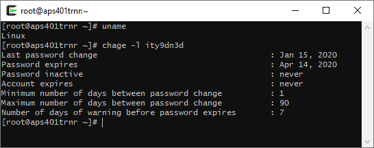
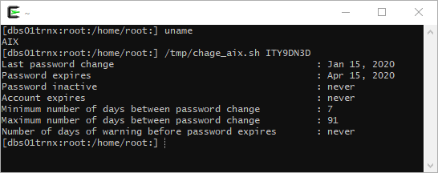

# Chage for AIX
Project for providing a `chage -l`-like output in an **AIX System**. 

## Background
During one of my working experiences i had the chance to work on **AIX** (which i _never touched before_). While using AIX i struggled to get over the **differences** with **Linux/Red Hat** (which was installed on the majority of the production servers we had). 

One of them was while doing trivial things like managing my account by checking the **password expiration date** to change in time.  
I searched on the Internet and didn't find anything **ready out of the box**.

Then i found that years before Giorgio, a coworker of mine, already made a script that managed to get when the **password** was **last changed**, when it would **expire** and if the account was **locked**. This gave me the idea of creating a "clone" of **`chage -l` for AIX** to **close this gap** and to have fun... :)

## Instructions
To use it:
1. **Copy**/scp the [script](./chage_aix.sh) into a path of your choice (i'll use `/tmp/chage_aix.sh`)
2. Make it **executable**
3. **Launch** it: `/tmp/chage_aix.sh USERNAME`

## Output comparison:
* Linux (`chage -l`)  
  
  

* AIX (`aix_chage`)  
  
  
